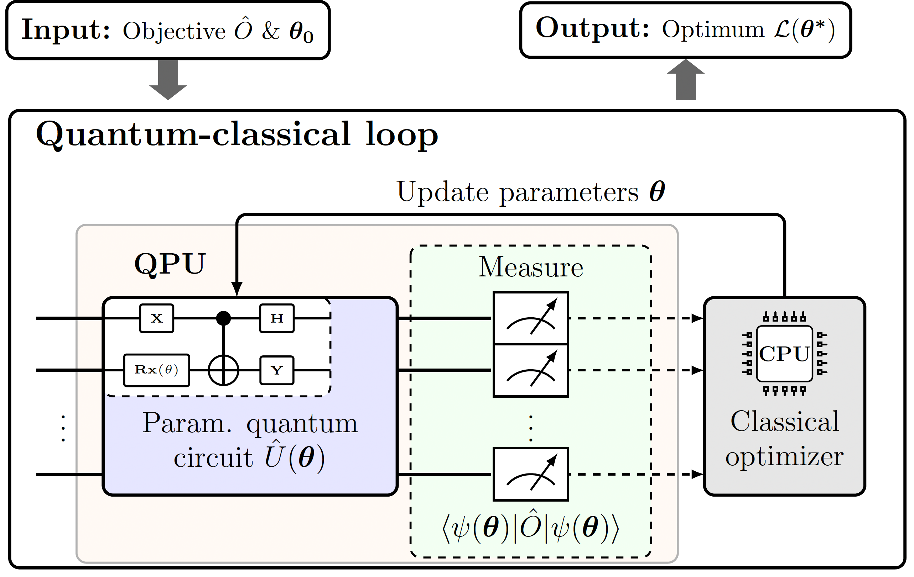

# A library for variational quantum algorithms

## Background
This library provides quantum circuits for variational quantum algorithms, which are an approach to quantum computing that utilizes classical optimization techniques to find the optimal parameters for a quantum circuit to solve a given problem. The circuits provided in this library are used to benchmark the performance of optimizers introduced in the paper "Optimizing Variational Quantum Algorithms with qBANG: A Hybrid Approach to Tackle Flat Energy Landscapes" [[arXiv](UPDATE LINK)].



## Installation and use


The package `qflow` is prepared such that it can be installed in development mode locally (such that any change in the code is instantly reflected). To install `qflow` locally, clone/download the repository and run the following command from the qflow folder:

```
pip install -e .
```

Then, run any of the notebooks in the example folder to play around with variational quantum circuits. 

To run the quantum chemistry examples you need to install [pyscf](https://pyscf.org/). 

Feel free to reach out to me at dpfitzek@gmail.com if you face any issues.


## Contributing
We welcome contributions to this project! If you'd like to contribute, please submit a pull request with your changes. If you have any questions or suggestions, please feel free to contact us at dpfitzek@gmail.com.

## Testing and verification

For testing and verification of the software run:

```
python -m pytest src/qflow/tests
```

## Uninstalling

If you want to deinstall the library use:

```
pip uninstall qflow
```


## Acknowledgements

We found several very helpful codebases when building this repo, and we sincerely thank their authors:

+ PennyLane Tutorials:
    + [Alleviating barren plateaus with local cost functions](https://pennylane.ai/qml/demos/tutorial_local_cost_functions.html)
    + [Quantum natural gradient](https://pennylane.ai/qml/demos/tutorial_quantum_natural_gradient.html)
    + [Barren plateaus in quantum neural networks](https://pennylane.ai/qml/demos/tutorial_barren_plateaus.html)

## Citation

If you find this repo useful for your research, please consider citing our paper:

```bibtex
@article{opt-vqa-with-qbang,
  title={Optimizing Variational Quantum Algorithms with qBANG: A Hybrid Approach to Tackle Flat Energy Landscapes},
  author={Fitzek, David and Jonsson, Robert S. and Dobrautz, Werner and Schäfer, Christian},
  journal={arXiv preprint arXiv:XXXX.XXXX},
  year={2023},
}
```

## Version History

Initial release (v1.0): April 2023

## Team

Current maintainers:

+ [David Fitzek](https://www.linkedin.com/in/david-fitzek-1851b1162/) ([@therealdavidos](https://twitter.com/therealdavidos),
  davidfi@chalmers.se),

## License

MIT License
